## 📸 Demostración Visual del Sistema

> **Nota para Reclutadores:** Debido a los costos de infraestructura para alojar aplicaciones Java empresariales, este proyecto se ejecuta en un entorno local. A continuación, se detalla el funcionamiento de la interfaz y la lógica de negocio a través de capturas del sistema.

### 🏠 Inicio y Cronograma Principal

  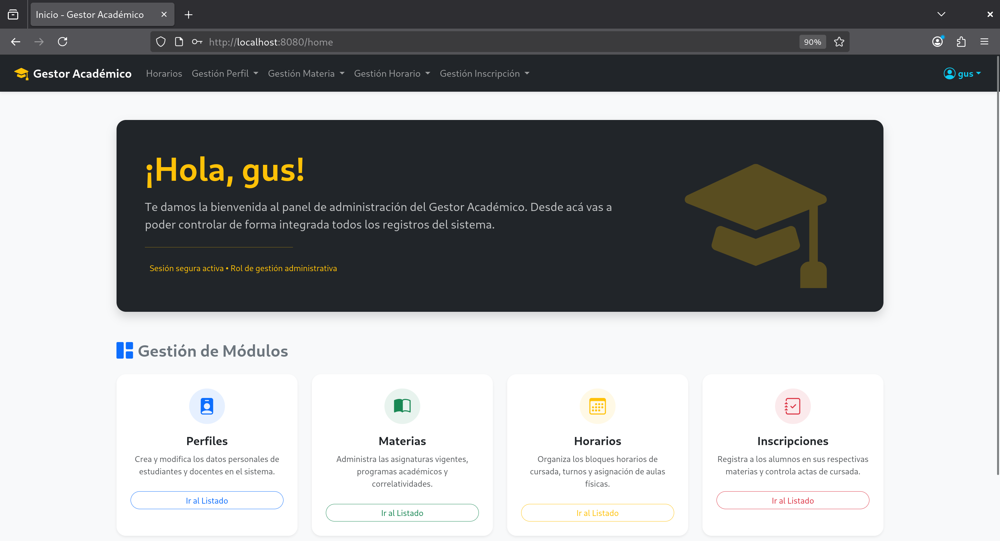

  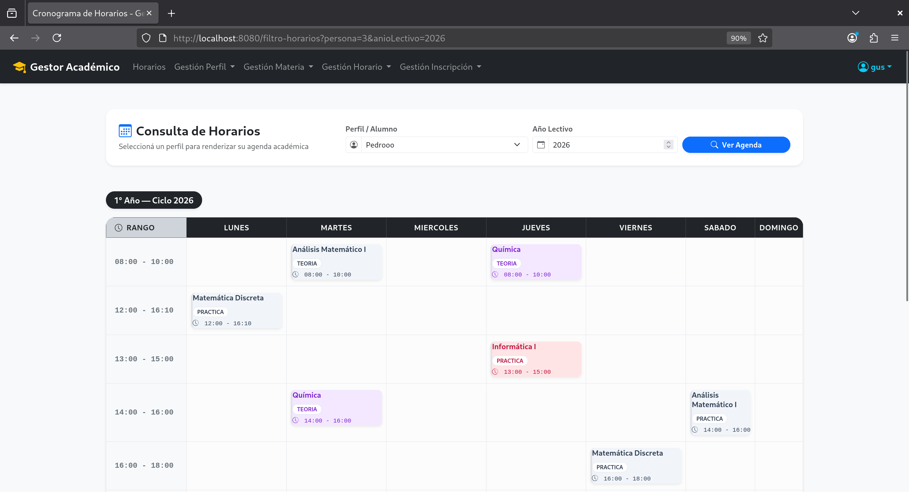

### ⚙️ Módulos del Sistema (Desplegables)

  
<b>🔐 1. Autenticación y Seguridad</b>

   
  <table align="center">
    <tr>
      <td align="center"><b>Iniciar Sesión</b></td>
      <td align="center"><b>Registro</b></td>
    </tr>
    <tr>
      <td>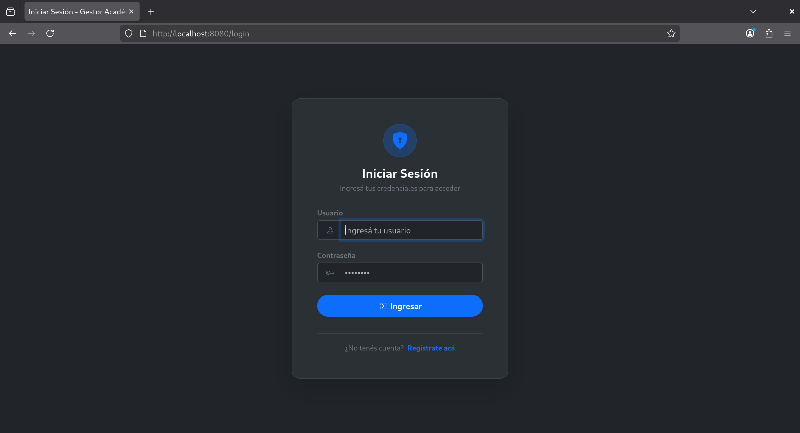</td>
      <td></td>
    </tr>
  </table>

  
<b>👤 2. Gestión de Perfiles (CRUD)</b>

   
  <table align="center">
    <tr>
      <td align="center"><b>Listado General</b></td>
      <td align="center"><b>Buscador por ID</b></td>
    </tr>
    <tr>
      <td>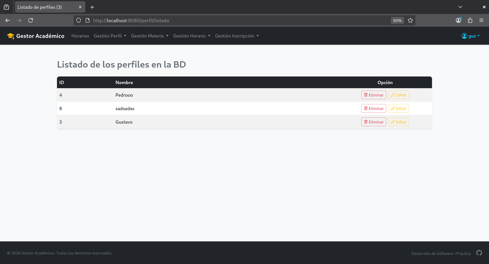</td>
      <td>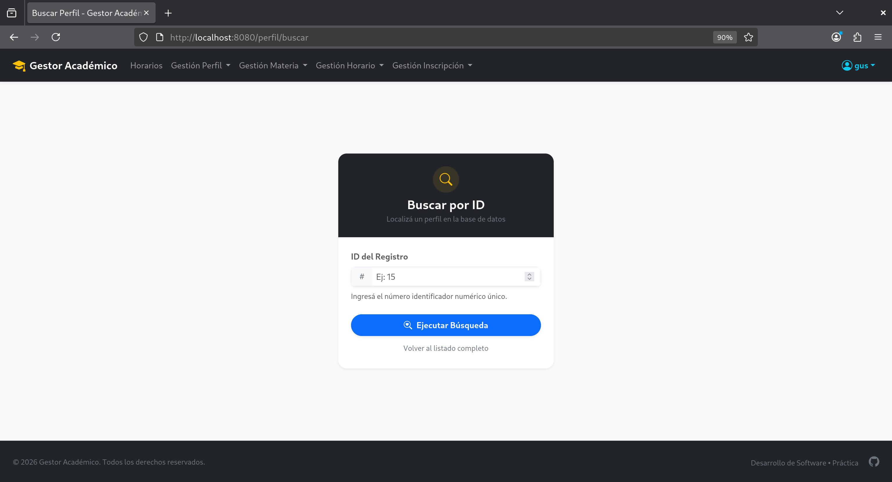</td>
    </tr>
    <tr>
      <td align="center"><b>Crear Perfil</b></td>
      <td align="center"><b>Modificar Perfil</b></td>
    </tr>
    <tr>
      <td>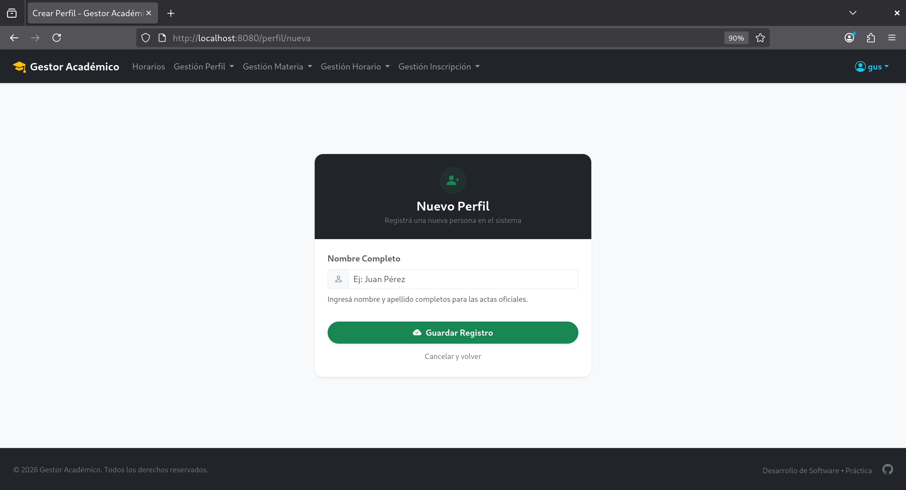</td>
      <td>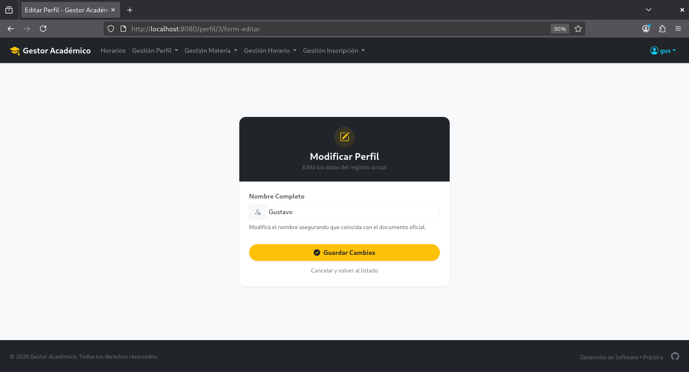</td>
    </tr>
  </table>

  
<b>📚 3. Gestión de Materias</b>

   
  <table align="center">
    <tr>
      <td align="center" colspan="2"><b>Listado de Materias</b></td>
    </tr>
    <tr>
      <td colspan="2" align="center">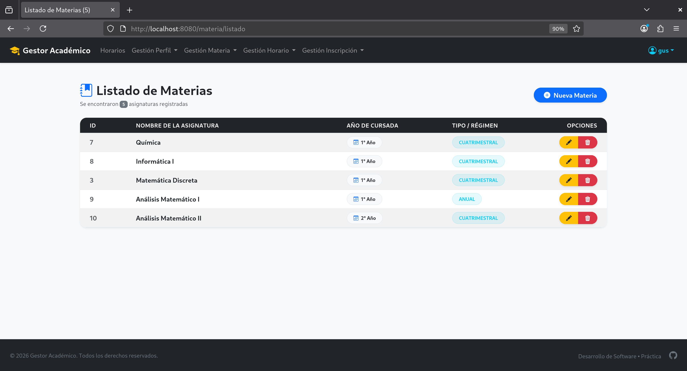</td>
    </tr>
    <tr>
      <td align="center"><b>Crear Materia</b></td>
      <td align="center"><b>Modificar Materia</b></td>
    </tr>
    <tr>
      <td>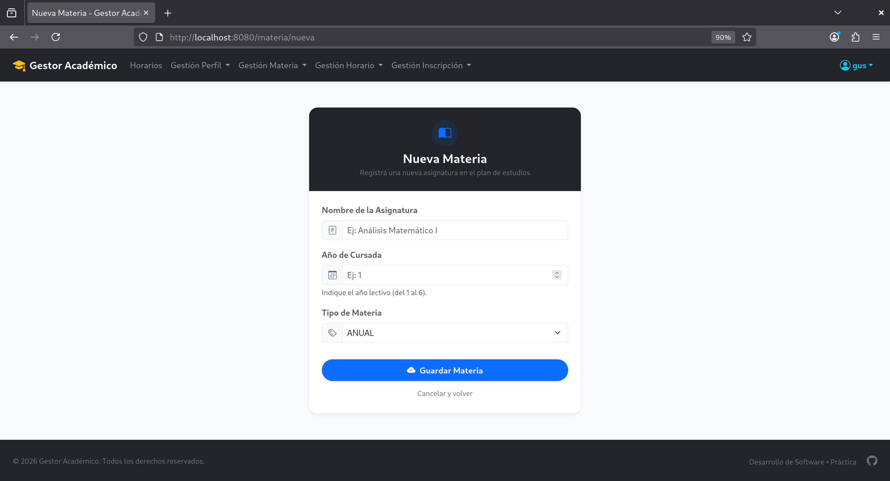</td>
      <td>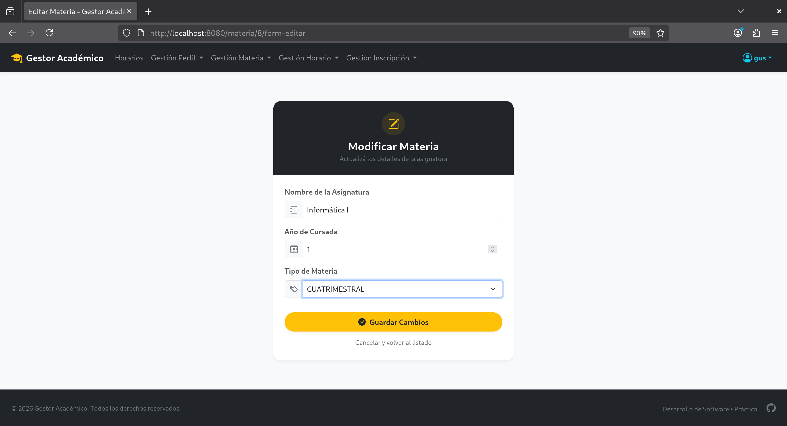</td>
    </tr>
  </table>

  
<b>📅 4. Administración de Horarios</b>

   
  <table align="center">
    <tr>
      <td align="center" colspan="2"><b>Listado de Horarios</b></td>
    </tr>
    <tr>
      <td colspan="2" align="center">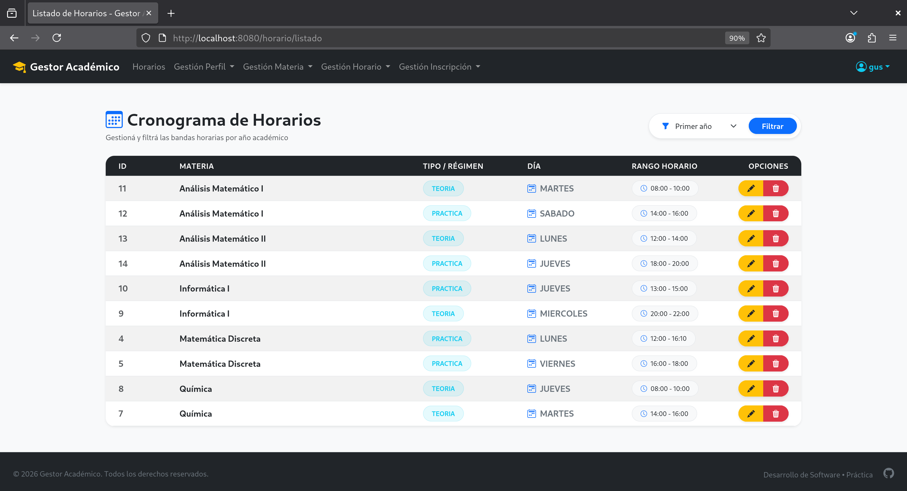</td>
    </tr>
    <tr>
      <td align="center"><b>Crear Horario</b></td>
      <td align="center"><b>Modificar Horario</b></td>
    </tr>
    <tr>
      <td>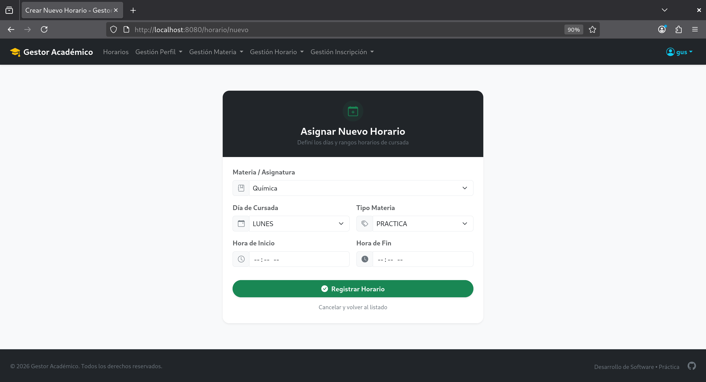</td>
      <td>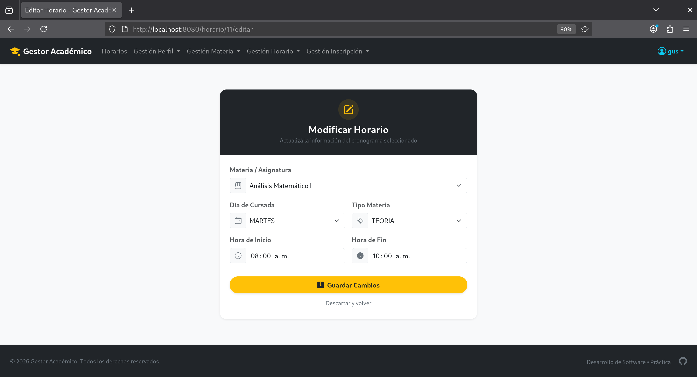</td>
    </tr>
  </table>

  
<b>📝 5. Gestión de Inscripciones</b>

   
  <table align="center">
    <tr>
      <td align="center" colspan="2"><b>Listado de Inscripciones</b></td>
    </tr>
    <tr>
      <td colspan="2" align="center">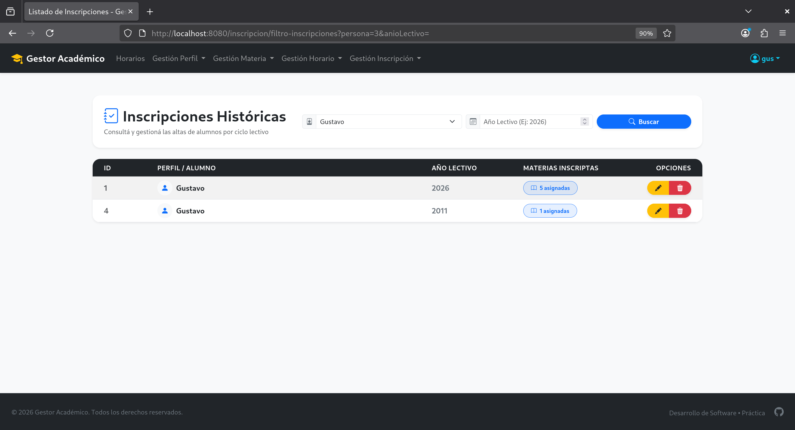</td>
    </tr>
    <tr>
      <td align="center"><b>Crear Inscripción</b></td>
      <td align="center"><b>Detalle - Crear</b></td>
    </tr>
    <tr>
      <td>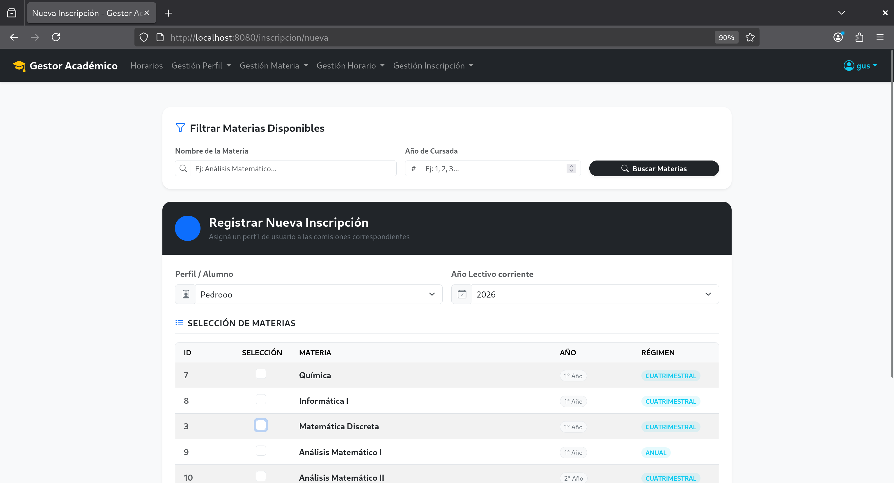</td>
      <td>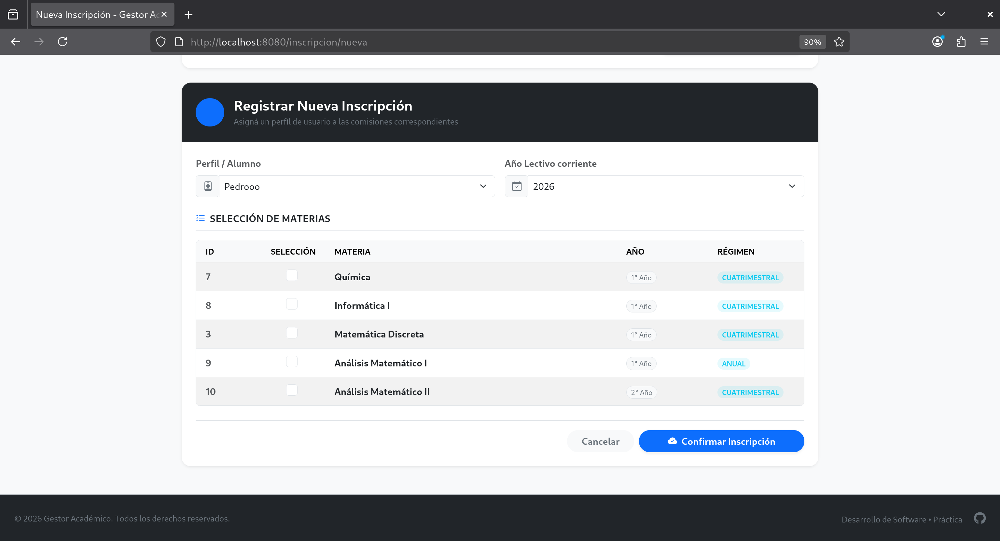</td>
    </tr>
    <tr>
      <td align="center"><b>Modificar Inscripción</b></td>
      <td align="center"><b>Detalle - Modificar</b></td>
    </tr>
    <tr>
      <td>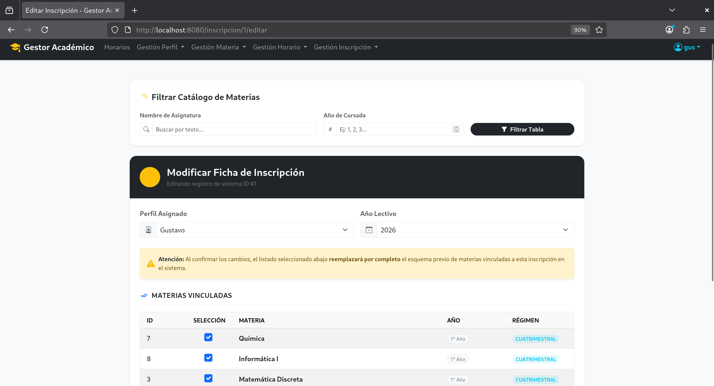</td>
      <td>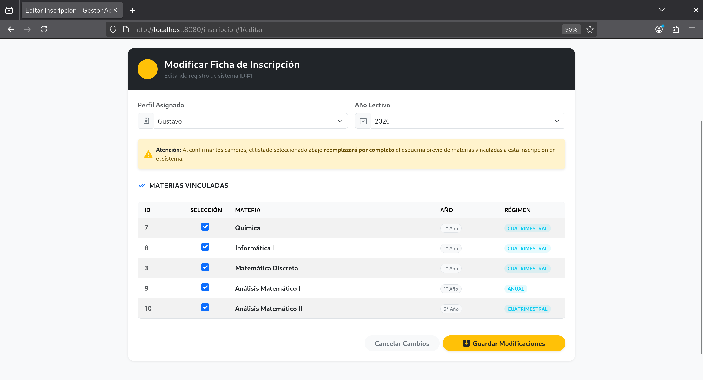</td>
    </tr>
  </table>

